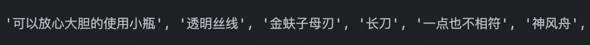

# 《凡人修仙传》韩立武器提取算法

## 思路1
使用规则进行提取，比如说使用jieb库对文本进行分词，然后使用规则进行提取。
我们认为分词中出现设定的剑、刀、枪、棍、锤、斧、钺、钩、叉、戟、锏、镗、锤等认为是武器
同一个句子中出现韩立，我等代词，加上动作（祭出、使用），再加上武器分词，则认为是提取出武器
我们认定这个规则就可以找出对应的武器
效果很一般：

## 思路2
使用预训练好的ner实体识别模型，对句子进行提取。
但是这个会出现一个问题，命名实体识别的类别不一定会存在<武器>这个类别，最多识别出<短剑>这种类型的内容。
需要针对特定的数据集进行迁移学习，现在用的模型效果一般。
优化方案有以下两种：
1. 如果需要重新训练的话，问题就转化为零样本学习问题。这个时候需要不断扩充数据集实现。
2. 使用知识蒸馏，用大规模的模型针对这个任务对小模型进行蒸馏。

使用这个思路的时候需要充足的计算资源。
注意：对应的模型原本是在model文件夹下，但是压缩文件会非常大，所以在这里进行删除。如果要运行需要下载一下模型
所使用的模型有：
hfl/chinese-bert-wwm-ext
bert-base-chinese-finetuned-ner

## 思路3
既然预训练的小模型没有这种分类的类别。
那么直接使用LLM这种使用大规模数据库进行训练的模型进行命名实体识别。
需要注意的是需要编写prompt，必须设置好输入和输出，给出示例。
效果非常好，需要的时间比较长：
效果文件可以查看hanli_weapons_extracted_test.json和hanli_weapons_extracted.json
优化：使用线程池并发提取，可以提高速度。

总结：
简单来讲就这3个思路。